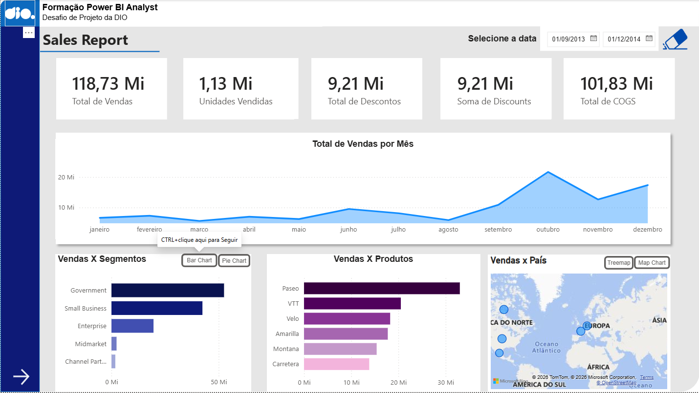
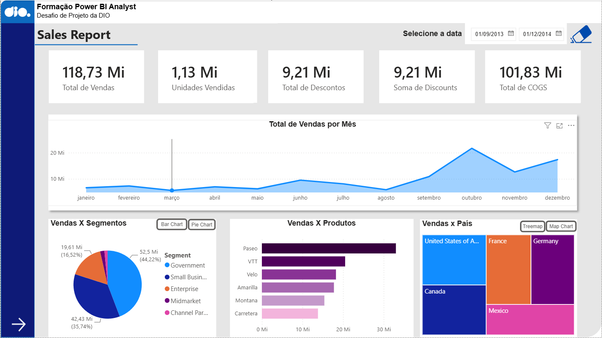
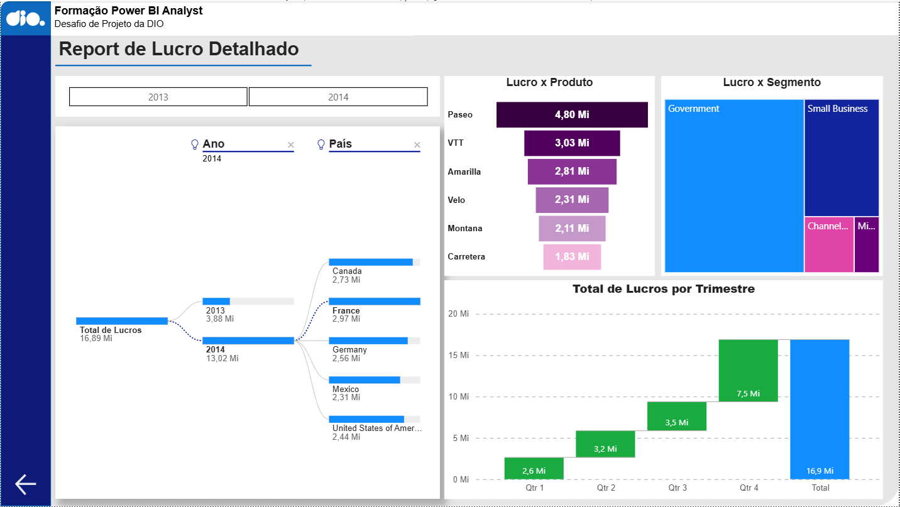

# 📊 Projeto 2 – Primeiros Passos com Power BI

## 📖 Sobre o projeto

Este repositório reúne o **Projeto 2** desenvolvido durante o **Bootcamp Universia – Primeiros Passos em Power BI**, promovido pela **DIO (Digital Innovation One)**.

Neste projeto criei um relatório no Power BI Desktop com base na sample Financials disponibilizada pela própria Microsoft

---

## 🎯 Objetivos

* Compreender a interface do Microsoft Power BI Desktop.

* Criar visualizações e gráficos interativos.

* Organizar um relatório seguindo boas práticas de Business Intelligence.

* Publicar o projeto como parte do meu portfólio no GitHub.

---

## 🛠️ Tecnologias e Ferramentas

* Microsoft Power BI Desktop
* Power Query
* Microsoft Excel (quando aplicável)
* Git e GitHub

---

## 📈 Competências Desenvolvidas

Durante a execução deste projeto foram praticadas as seguintes habilidades:

* Importação e tratamento de dados;

* Limpeza e organização de informações;

* Criação de visualizações interativas;

* Construção de dashboards;

* Organização de projetos no GitHub;

* Documentação técnica utilizando Markdown.

---

## 📸 Dashboard

## 🚀 Como visualizar o projeto

1. Clone este repositório.
2. Abra o arquivo `.pbix` utilizando o **Microsoft Power BI Desktop**.
3. Explore as páginas do relatório e as visualizações criadas.

---

## 📚 Sobre o Bootcamp

Este projeto faz parte do **Bootcamp Universia – Primeiros Passos em Power BI**, oferecido pela **DIO (Digital Innovation One)**, cujo objetivo é desenvolver fundamentos de Business Intelligence por meio de atividades práticas utilizando o Microsoft Power BI.

---

## 👨‍💻 Autor

**Guilherme Polato**

Graduado em Análise e Desenvolvimento de Sistemas, com foco em Análise de Dados e Business Intelligence.

---

## ⭐ Considerações Finais

Este repositório representa uma etapa importante da minha evolução na área de Dados. Conforme avanço nos estudos, novos projetos serão adicionados ao meu portfólio, demonstrando a aplicação prática de conceitos de Business Intelligence, modelagem de dados e criação de dashboards com Power BI.
